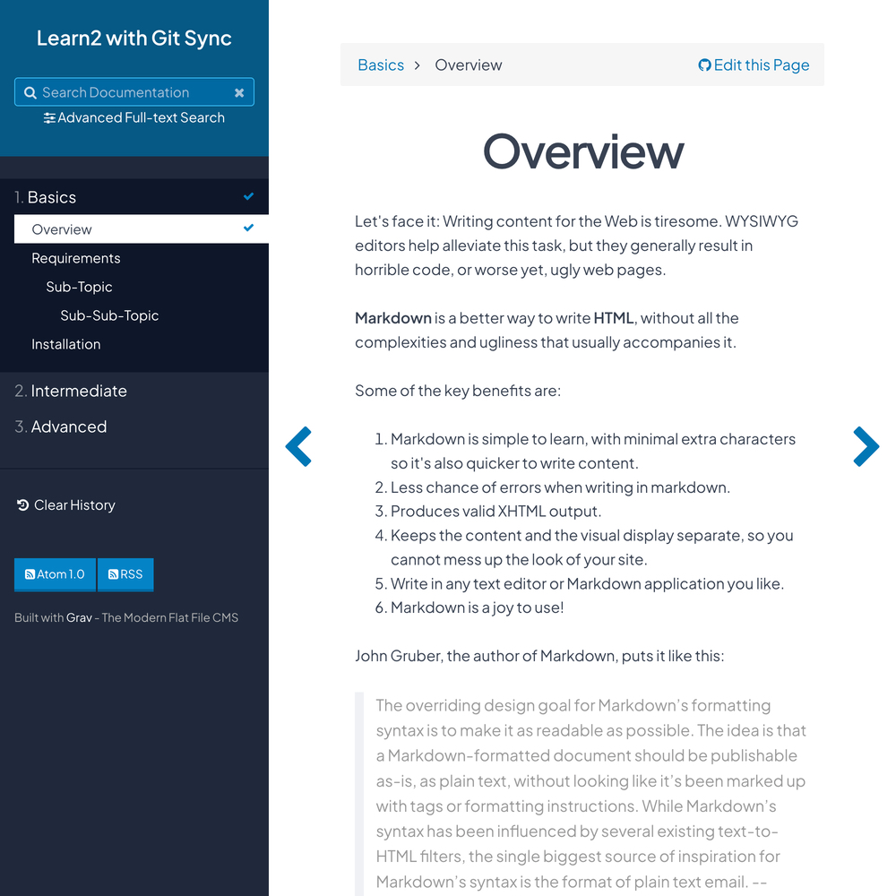

# Learn2 with Git Sync Skeleton



This is a sample skeleton site that mimics the official Grav documentation: http://learn.getgrav.org.  This skeleton uses the [Learn2 Git Sync theme](https://github.com/hibbitts-design/grav-theme-learn2-git-sync), a customized version of the [Learn2 theme](https://github.com/getgrav/grav-theme-learn2).

> Detailed documentation for this project is now available at http://learn.hibbittsdesign.org/learn2withgitsync

# Base Learn2 Theme Features

* Lightweight and minimal for optimal performance
* Fully responsive with off-page mobile navigation
* SCSS based CSS source files for easy customization
* Built specifically for providing easy to read documentation
* [Font Awesome](http://fontawesome.io/) icon support
* Viewed page tracking
* Integrated support for documentation content sourced/maintained via GitHub

# Supported Page Templates

* "Docs" template
* "Chapter" template
* Error view template

## Video Walkthrough of Learn2 with Git Sync Configuration
[](https://www.youtube.com/watch?v=aO3CW0yc4_Y)  
_Video 1. Learn2 with Git Sync Configuration_

# Configuration

```
top_level_version: false
home_url:
github:
    enabled: true
    position: top
    tree: https://github.com/getgrav/grav-skeleton-rtfm-site/blob/develop/
```

| Setting           | Child Setting | Description                                                                                                            |
| :-----            | :-----        | :-----                                                                                                                 |
| top_level_version |               | When set to `true`, displays level icons and numbered lists.                                                           |
| home_url          |               | Enables you to enter a different URL link from the logo (ex: http://google.com)                                        |
| github            | enabled       | Can be set to `true` or `false`. When set to `true`, it generates the **Edit this page** link to GitHub for each page. |
| github            | position      | Sets the position for the GitHub edit link. Can be set to `top` or `bottom`.                                           |
| github            | tree          | Sets the tree by which your site's content is based. Generally the repo your site's content is pulled from.            |

## Basic Setup for a New Grav Site

The simplest way to install the Learn2 Git Sync theme with sample content for Grav is to download and install the Learn2 with Git Sync Skeleton package:

1. [Download Learn2 with Git Sync Skeleton](http://getgrav.org/downloads/skeletons#extras)
2. Unzip the package into your web root folder.
3. Point your browser at the folder.
4. Job done!

**TIP:** Check out the [general Grav Installation Instructions](http://learn.getgrav.org/basics/installation) for more details on this process.

---
